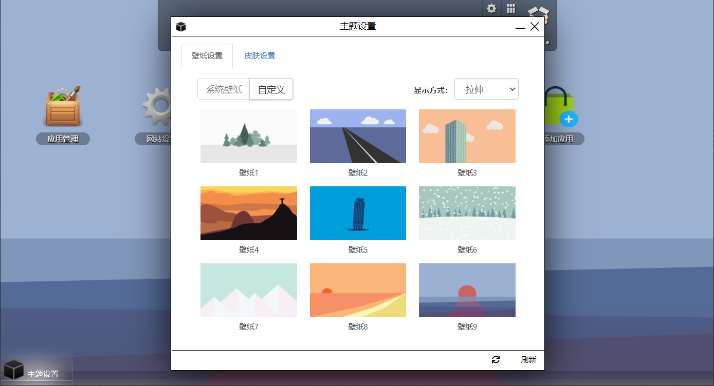
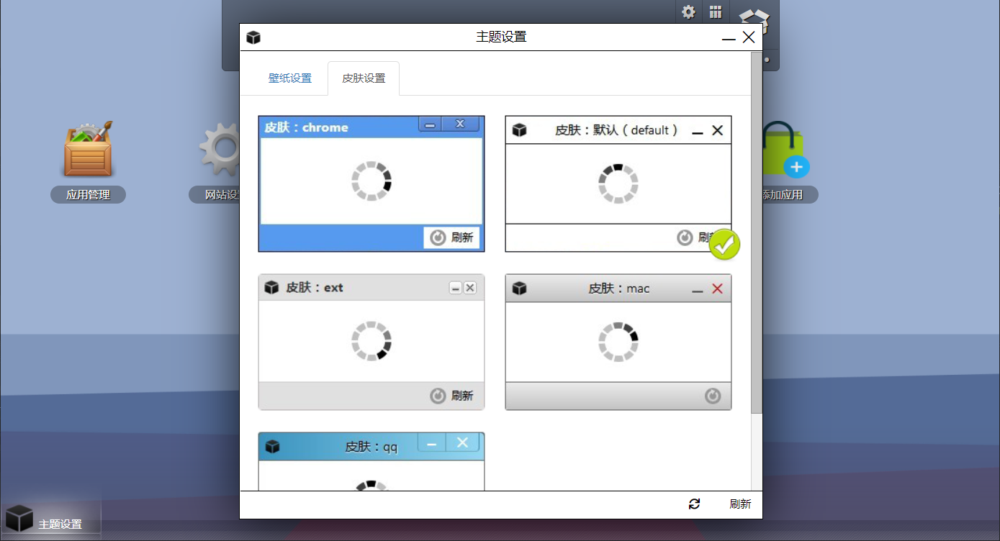
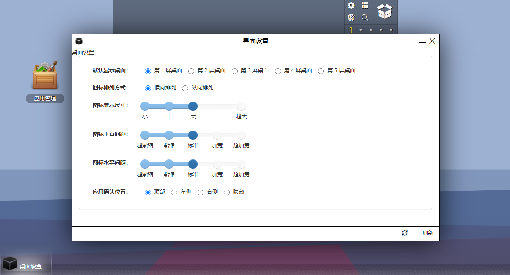
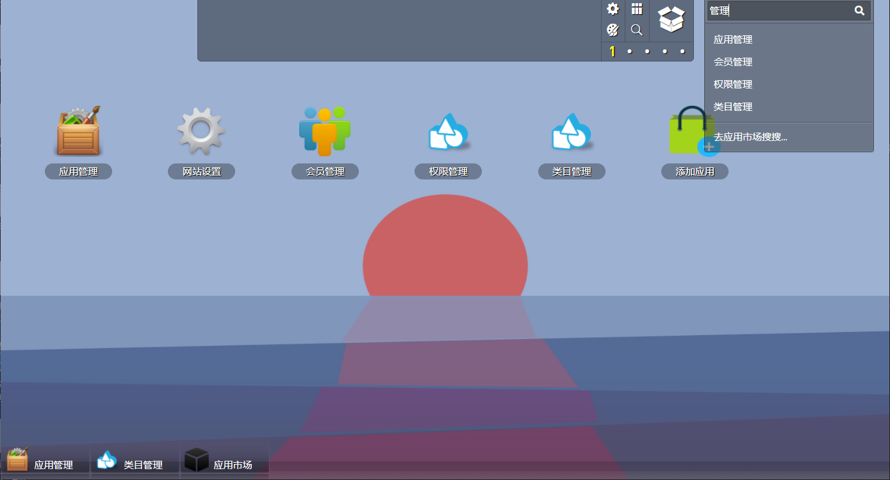

# HoorayOS

## 作者寄语

这个框架是我在刚入程序员这行时，为了学习 jQuery 而写的一个练手项目，随着功能一点点的完善，也发现并拓展了一些商业价值。做为一款曾经的付费框架，它给我带来过不错的收益，其中不乏有BAT中的T厂也曾向我采购过此项目。

但由于技术发展和业务更新，这个框架也逐渐不被市场所需要，昨天帮我续费域名的朋友和我说，[http://hoorayos.com](http://hoorayos.com) 这个域名下个月就到期了，是否还要续费。思考过后决定不再续费了，同时也决定将源码完全开源。

对我个人来说，这个框架已经是一段历史；但对你来说，如果你对该框架感兴趣，你完全可以用于商业或非商业的项目中，你可以自由发挥，二次开发，只要遵循 MIT 开源协议即可。

—— Hooray 写于 2021/1/30

## 使用说明

推荐使用 [WampServer](https://sourceforge.net/projects/wampserver/) 运行，需要安装 composer 并在项目内执行 `composer i` 安装依赖，然后将 `_sql/hoorayos.sql` 数据库文件导入到 mysql 中，最后在 `inc/config.php` 里修改数据库连接配置即可。

管理员默认帐号/密码均为：`hoorayos`

## 主要技术栈

php + mysql + jquery

## 预览

<table>
    <tr>
        <td></td>
        <td></td>
        <td></td>
    </tr>
    <tr>
        <td></td>
        <td></td>
        <td></td>
    </tr>
    <tr>
        <td></td>
        <td></td>
        <td></td>
    </tr>
</table>

## 推广

[Fantastic-admin](https://hooray.gitee.io/fantastic-admin)

一款开箱即用的 Vue 中后台管理系统框架